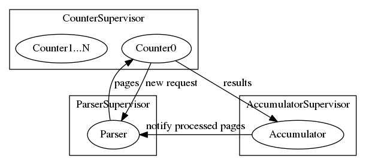

# Capdist

**WARNING:** Code for learning.

A **dist**ributed **c**ounter/**a**ccumulator/**p**arser for counting words
on Wikipedia dumps.

This is a project highly inspired by Paul Butcher's book
[Seven Concurrency Models in Seven Weeks](https://pragprog.com/book/pb7con/seven-concurrency-models-in-seven-weeks) and
implemented by multiple programming languages. It is a pretty simple system,
with its architecture shown in the following figure:

## License

ISC
